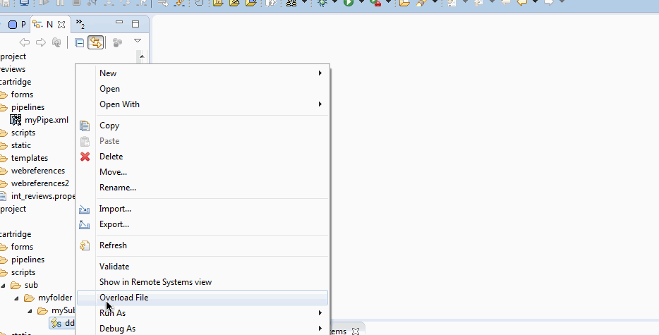

# Overloader
> An eclipse plugin that will add a context menu option to overload a file between different DW cartridges.

### Installation

1. Download the latest release from [here](release)
2. Add the `.jar` file in your `eclipse/plugins` directory.
3. Restart eclipse

### Author

Mihai Ionut Vilcu
 
+ [github/ionutvmi](https://github.com/ionutvmi)
+ [twitter/ionutvmi](http://twitter.com/ionutvmi) 

### License
Copyright (c) 2015 Mihai Ionut Vilcu   
Released under the MIT license

